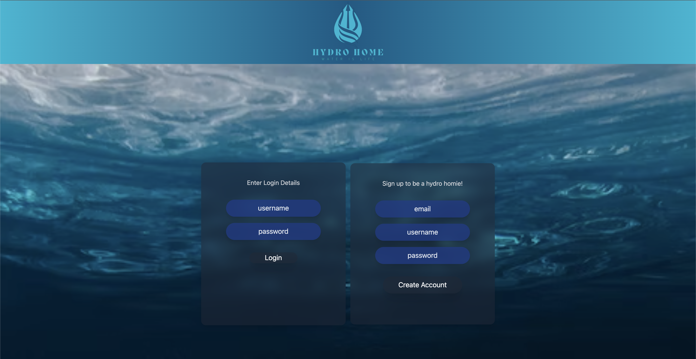

# hydro-home

  

  ## Description
  Hydro home is a solution to monitor and track water consumption versus your daily goal. Users are able to see their water consumption data as well as create posts and comment on other users' posts.

  ## User Story
    As a water consumer
    I want an application to track my water consumption
    So that I know I'm drinking enough water each day

  ## Table of Contents

  *[Description](#description)

  *[Installation](#installation)

  *[Usage](#usage)

  *[License](#license)

  *[Contributing](#contributing)

  *[Tests](#tests)

  *[Questions](#questions)

  *[Credits](credits)

  ## Installation
  First, git clone the repository to your local system. Then, run CLI and run npm install to install all dependencies. Finally, run npm start.

  ## Usage
  Navigate to the deployements page and click on the heroku link to view our website: Or click this link.
  [Heroku Deployment](https://hydro-home.herokuapp.com/)

  ## License
    This project is covered under the MIT license. To learn more about what this means, click the license badge at the top.

  ## Authors
  @beefbones - Nolan Ross

  @LBissette - Logan Bissette

  @kmorrison12 - Katie Morrison

  @jNighton - Jaykob Nighton

  @ckester99 - Christian Kester

  ## Questions
  Have questions about this project?

  Name: Nolan Ross

  Github: https://github.com/beefbones

  Email: nolanross917@gmail.com
  